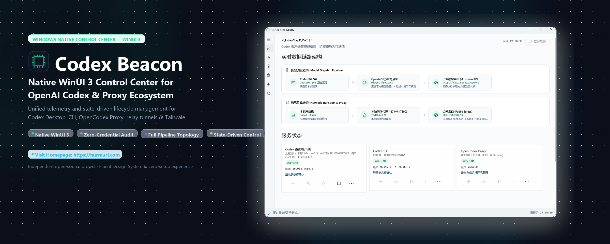

<p align="center">
  <a href="https://hurmuri.github.io/codex-beacon/"></a>
</p>

<h1 align="center">Codex Beacon</h1>

<p align="center">
  <strong>All-in-One Control Center for Codex: Unified orchestration for ChatGPT Desktop and Codex CLI on Windows, with optional OpenCodex, Relay, and Tailscale extensions.</strong>
</p>

<p align="center">
  <a href="https://hurmuri.github.io/codex-beacon/"><strong>🌐 Official Website: GitHub Pages</strong></a> · 
  <a href="#downloads--quick-run"><strong>⚡ Download Portable Release</strong></a> · 
  <a href="README.zh-CN.md">简体中文说明</a>
</p>

<p align="center">
  <a href="https://hurmuri.github.io/codex-beacon/"></a>
  <a href="https://github.com/hurmuri/codex-beacon/releases"></a>
  <a href="https://github.com/hurmuri/codex-beacon"></a>
  <a href="https://learn.microsoft.com/windows/apps/winui/winui3/"></a>
  <a href="LICENSE"></a>
  <a href="https://github.com/openai/codex"></a>
  <a href="https://github.com/lidge-jun/opencodex"></a>
  <a href="https://github.com/gronxb/codex-relay"></a>
  <a href="https://tailscale.com"></a>
</p>

Codex Beacon is a native, light-theme WinUI 3 control center for inspecting and managing the Codex desktop app, Codex CLI, OpenCodex Proxy, Codex Relay, Node.js/NVM/npm, and Tailscale on Windows.

Codex Beacon supports English and Simplified Chinese. It follows the Windows display language by default, and the language can be changed under Settings. `build/version.txt` is the single version source and increments on every build; the running version is always shown under Settings → About & update. The Codex desktop app and CLI are core features; OpenCodex Proxy and Codex Relay are independent optional modules. Installing an extension never changes the active Codex provider automatically.

## About

Codex Beacon is an open-source system manager designed specifically for developers using OpenAI Codex on Windows. As the local AI development toolchain expands, developers frequently coordinate multiple distinct services: the official Codex desktop client (`OpenAI.Codex`), CLI utilities, community proxy bridges like OpenCodex, mobile relay tunnels, specific Node.js versions, and Tailscale virtual private networks.

Before Codex Beacon, monitoring and managing these components required juggling Task Manager, multiple PowerShell windows, npm CLI commands, and configuration files. Codex Beacon solves this by bringing everything together into a cohesive, Windows-native desktop application.

### Key Highlights

- **Windows Native & Modern**: Crafted exclusively with WinUI 3, Windows App SDK 1.8, and Fluent Design System guidelines. Lightweight, clean, high-contrast light theme without web-wrapper overhead.
- **Protected Credentials**: The vNext Provider editor uses a password field hidden by default. An explicitly saved key is stored locally in a current-user-only configuration file and is excluded from uploads, command lines, logs, errors, diagnostics, crash reports, status text, and default exports.
- **State-Driven Workflow**: Every action (install, sign in, start, stop, restart, upgrade) is strictly bounded by component status—preventing accidental duplicate instances or broken configurations.
- **Modular & Non-Intrusive**: Codex desktop and CLI are core; OpenCodex and Codex Relay are purely optional extensions. Missing extensions never degrade core system status.
- **Bilingual & Instant Switching**: Seamlessly supports English and Simplified Chinese with instant, in-app UI switching without requiring process restarts.
- **Self-Updating**: Checks the official GitHub release feed, shows a banner when a newer build exists, streams the download with progress and a SHA-256 check, then replaces the install package in place and restarts into the new version.

## Upstream projects

- [Codex CLI · openai/codex](https://github.com/openai/codex)
- [OpenCodex · lidge-jun/opencodex](https://github.com/lidge-jun/opencodex)
- [Codex Relay · gronxb/codex-relay](https://github.com/gronxb/codex-relay)
- [NVM for Windows](https://github.com/coreybutler/nvm-windows)
- [Node.js](https://github.com/nodejs/node) and [npm CLI](https://github.com/npm/cli)
- [Tailscale](https://github.com/tailscale/tailscale)

## Implementation references

- [Wangnov/Codex-App-Manager](https://github.com/Wangnov/Codex-App-Manager): reference for Codex desktop version discovery and management.
- [v2fly/domain-list-community](https://github.com/v2fly/domain-list-community): reference for network-domain classification. Its rules are not bundled or read by the current release.

## Implemented

- Separate version, process, sign-in, and update detection for the Codex desktop app and Codex CLI. Each executable's version is read from its own install source (npm global, `PATH`, or the copy bundled with the desktop app), so several different versions can coexist on one machine.
- Local/latest version comparison for `@openai/codex`, `@bitkyc08/opencodex`, and `codex-relay` using the official npm registry.
- State-driven actions per component (install, sign in, start, stop, restart, upgrade), plus a separate optional-module list on the Installation page.
- NVM for Windows detection, installed Node.js inventory, version installation, and active-version switching.
- Node.js downloads use a configurable mirror and fall back to the official host automatically, so an unreachable `nodejs.org` can no longer stall an install.
- Node.js ≥ 22.14.0 and npm prerequisite checks before npm-based modules can be installed.
- Provider switching that rewrites `model_provider` — and adds or removes the local-proxy `openai_base_url` — in `%USERPROFILE%\.codex\config.toml`.
- Public egress reported from OpenAI's point of view, enriched with country, region, city, ISP, AS number, hosting/proxy classification, and a trust score.
- Tailscale service, local node, Tailnet device, address, online, and last-seen status.
- Allowlisted bulk recovery that excludes the Codex desktop app, Codex Beacon, and unrelated Node.js processes.
- Long-running actions stream native tool output and can be cancelled, and every action has a hard timeout so the window never appears frozen.
- English and Simplified Chinese UI, diagnostics, action results, and instant in-app language switching.
- Every build bumps its own version from `build/version.txt`, so each compiled artifact carries a distinct version.
- In-app updates against the official GitHub Releases channel: version check, prompt on startup, manual check, streamed download with progress and speed, SHA-256 verification, skip-this-version, and an in-place restart into the new build.

## Approved vNext direction

The canonical plan is [PRODUCT-REQUIREMENTS.md](PRODUCT-REQUIREMENTS.md). The app will use nine focused destinations: Codex overview, Dependencies, Codex processes, Network, Providers, OpenCodex, Tailscale, Codex Relay, and Settings / About & updates.

The overview will focus only on ChatGPT desktop and the active user-managed Codex CLI, while dependency repair, network checks, provider CRUD/testing, and optional modules move to dedicated pages. OpenCodex will expose its structured provider, model, health, and native-integration capabilities through its own page.

Every download will show its real stage, transferred/total bytes when available, percentage, speed, elapsed time, and safe cancellation. Provider keys use a password field hidden by default and may be saved in plaintext under `%USERPROFILE%\.CodexBeacon\providers.json`; `.CodexBeacon` is explicitly hidden, the file is restricted to the current Windows user, and keys are excluded from uploads, command lines, logs, errors, diagnostics, and default exports.

The current About and application-update experience remains. Component-specific task names and settings move to their owning pages: runtime sources to Dependencies, proxy options to Network, OpenCodex service/task settings to OpenCodex, and Relay service/task settings to Codex Relay.

## Download and run

Each GitHub Release provides two single-file x64 executables:

| File | Best for | Runtime requirements |
| --- | --- | --- |
| `CodexBeacon-portable.exe` | Recommended; one file, run it directly | .NET 10 and Windows App SDK are bundled |
| `CodexBeacon-slim.exe` | Managed environments that already deploy the runtimes | [.NET 10 Desktop Runtime x64](https://dotnet.microsoft.com/download/dotnet/10.0) + [Windows App Runtime 1.8 x64](https://learn.microsoft.com/windows/apps/windows-app-sdk/downloads) |
| `SHA256SUMS.txt` | SHA-256 checksums for both executables | — |

No archive step is required. On first run the launcher expands its embedded payload into `%LOCALAPPDATA%\CodexBeacon\app-portable` and starts the manager from there. The in-app updater depends on this layout: it downloads the matching single-file build, replaces that launcher in place, and relaunches it, after which the refreshed launcher re-expands its payload.

Windows does not include .NET 10 or the required Windows App Runtime by default; choose the `portable` build when unsure.

Both builds require x64 Windows 10 1809 (build 17763) or later. Status collection uses Windows PowerShell 5.1, which is included with supported Windows versions. Unsigned community builds may trigger Windows SmartScreen. Network access is used for version checks, official installers, sign-in, and public-egress discovery.

Node.js, npm, NVM, Tailscale, OpenCodex, and Codex Relay are not prerequisites for launching Codex Beacon. They are required only for their corresponding management features. The UI detects missing dependencies and guides users through install → sign in → start. OpenCodex and Codex Relay require Node.js and npm; Relay requires Node.js 22.14.0 or newer.

The self-contained directory is currently about 214 MB and compresses to about 87 MB. Most of that size comes from the bundled .NET 10 runtime, WinUI 3 / Windows App SDK, DirectML, and ONNX Runtime components.

## Build from source

Building requires x64 Windows 10 1809 or later and the .NET 10 SDK.

```powershell
dotnet build .\CodexBeacon.csproj -c Release
dotnet run --project .\CodexBeacon.csproj
```

Create a self-contained directory:

```powershell
dotnet publish .\CodexBeacon.csproj -c Release -r win-x64 --self-contained true -p:WindowsAppSDKSelfContained=true -o .\publish\win-x64
```

## Permissions and safety boundaries

### Standard Non-Admin Mode (Recommended)

Codex Beacon is designed to run **without administrator privileges** by default:
- Live detection of Codex desktop, CLI, OpenCodex, and Relay status and dual-layer data flow pipelines;
- Querying public egress IP, geographical location, ISP, and outbound proxy type;
- Inspecting all running Codex and ChatGPT processes, with one-click termination and app restart;
- Detecting NVM and Node.js runtime environments.

### Operations Requiring Administrator Privileges (Marked with 🛡️)

The following specific actions may require UAC elevation on Windows:
1. **Tailscale System Service Control**: Starting, stopping, or restarting the Tailscale Windows service requires administrative access;
2. **NVM Global Version Switching (Protected Paths)**: If NVM creates symlinks under protected directories such as `C:\Program Files\nodejs`, switching versions requires administrator rights (unrestricted if NVM is installed under a user path);
3. **System Scheduled Tasks**: Registering or updating tasks running under system service accounts.

Codex Beacon never elevates silently. When an operation fails due to insufficient privileges, it provides an actionable error message prompting the user to restart as administrator if needed.

- Diagnostics never read or display tokens, authorization headers, passwords, cookies, or API keys. Saved provider keys remain masked and are excluded from diagnostic collection and export.
- A remote service IP is a process destination, not the machine's public egress IP. The UI displays them separately.
- The installed Codex desktop version comes from the local `OpenAI.Codex` MSIX/AppX package. The latest Windows package version comes from the Codex App Mirror manifest, which mirrors Microsoft Store product `9PLM9XGG6VKS`. The UI identifies that source, while installation and upgrades always open the official Microsoft Store page.

See [CONTRIBUTING.md](CONTRIBUTING.md), [DESIGN.md](DESIGN.md), [SECURITY.md](SECURITY.md), and the [MIT license](LICENSE).

## Local adaptation

In vNext, the OpenCodex page owns the `opencodex-proxy` scheduled-task/service name and the Codex Relay page owns the `Codex Relay` name. These listener ports are detected by default, but the active path only includes an endpoint supported by the selected provider and observed runtime evidence:

- OpenCodex Proxy: `127.0.0.1:10100`
- Codex Relay: `127.0.0.1:8787`
- Other providers: parsed dynamically from `%USERPROFILE%\.codex\config.toml`
