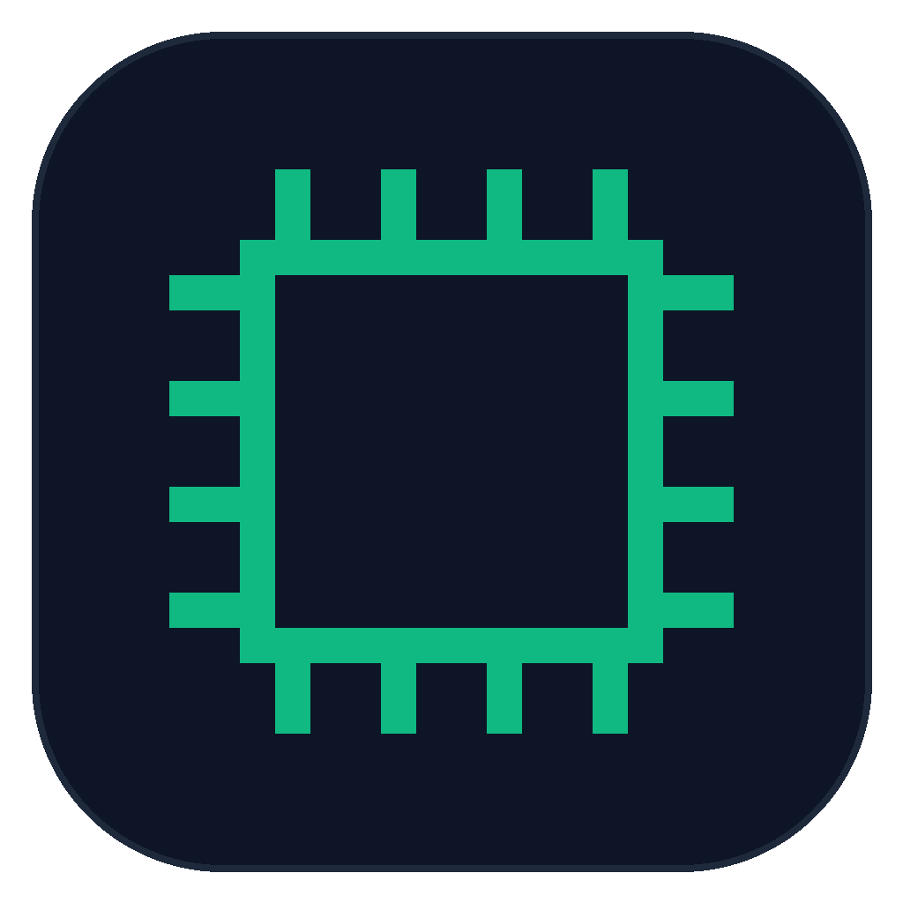

# Codex Beacon

<p align="center"></p>

<p align="center"><strong><a href="README.md">English</a> · 简体中文</strong></p>

[](https://github.com/hurmuri/codex-beacon/actions/workflows/build.yml)
[](LICENSE)
[](https://github.com/hurmuri/codex-beacon)

Codex Beacon 是一个明亮主题的 WinUI 3 本机控制台，用于检查和管理 Windows 上的 Codex 桌面客户端、Codex CLI、OpenCodex Proxy、Codex Relay、Node.js/NVM/npm 与 Tailscale。

当前版本为 `0.2.0`，支持英文和简体中文，默认跟随 Windows 显示语言，也可在设置页切换。Codex 桌面客户端与 CLI 是产品核心；OpenCodex Proxy 和 Codex Relay 为独立可选模块。安装扩展不会自动修改 Codex 的当前 provider。

## 关于项目 (About)

Codex Beacon 是专为 Windows 平台打造的 OpenAI Codex 工具链开源桌面管理看板。随着本地 AI 辅助研发工具链的扩展，开发者通常需要协同管理多个独立服务：OpenAI 官方 Codex 桌面客户端（`OpenAI.Codex`）、Codex CLI、社区模型代理扩展 OpenCodex、移动端远程中继 Codex Relay、特定版本的 Node.js/NVM 运行时环境，以及 Tailscale 组网连接。

在此之前，排查服务状态需要频繁穿梭于任务管理器、多开的 PowerShell 窗口、npm 全局包命令与各 TOML 配置文件之间。Codex Beacon 将这一整套分散的生命周期管理统一收敛至原生桌面面板中。

### 核心特性

- **微软原生体验**：基于 WinUI 3 与 Windows App SDK 1.8 打造，遵循 Windows 11 Fluent 视觉与动效规范。轻量明亮主题，杜绝 Web/Electron 包装带来的冗余资源消耗。
- **隐私优先与零凭据原则**：仅探测系统进程父子拓扑、网络连接端点与运行状态；严格禁止且绝不读取、存储或传输任何 API Key、Token、密码或用户数据流载荷。
- **状态驱动操作**：所有控制按钮（安装、登录、启动、停止、重启、升级）均由真实运行状态驱动，杜绝盲目点击导致的冲突或脏配置。
- **独立解耦架构**：Codex 官方客户端与 CLI 为产品核心，OpenCodex 与 Codex Relay 为独立可选扩展；缺少可选组件绝不会判定系统异常。
- **原生双语支持**：完整支持英文与简体中文，跟随系统或在设置中一键即时热切换，无需重启应用程序。

## 上游项目与参考

- [Codex CLI · openai/codex](https://github.com/openai/codex)
- [OpenCodex · lidge-jun/opencodex](https://github.com/lidge-jun/opencodex)
- [Codex Relay · gronxb/codex-relay](https://github.com/gronxb/codex-relay)
- [NVM for Windows](https://github.com/coreybutler/nvm-windows)
- [Node.js](https://github.com/nodejs/node)、[npm CLI](https://github.com/npm/cli)
- [Tailscale](https://github.com/tailscale/tailscale)
- [Wangnov/Codex-App-Manager](https://github.com/Wangnov/Codex-App-Manager)：Codex 桌面版本管理参考。
- [v2fly/domain-list-community](https://github.com/v2fly/domain-list-community)：网络域名分类参考；当前版本未打包或读取其规则。

## 已实现

- Codex 桌面客户端与 CLI 分开检测版本、进程、账号和更新方式。
- 从 npm 官方注册表比较 `@openai/codex`、`@bitkyc08/opencodex` 与 `codex-relay` 的本机/最新版本。
- 每行三个服务控制项，按状态启用安装、登录、启动、停止、重启或升级。
- NVM for Windows 检测、Node.js 版本列表、指定版本安装与当前版本切换。
- 安装 npm 模块前验证 Node.js ≥ 22.14.0 与 npm 前置条件。
- 根据 `model_provider`、`base_url`、监听端口归属和 TCP 连接构建实际代理主路径。
- 未激活的配置端点单独列出，不混入当前数据流。
- 分开显示本机公网出口 IP 与 Codex 相关进程连接的远端 IP。
- Tailscale 服务、本机节点、Tailnet 设备、地址、在线状态和最后活动时间。
- 安全的批量停止/重启，排除 Codex 桌面应用、Codex Beacon 和无关 Node 进程。
- 英文与简体中文界面、诊断和操作结果，并支持应用内即时切换语言。

## 下载与直接运行

GitHub Release 同时提供两个 x64 构建：

| 文件 | 适合场景 | 运行依赖 |
| --- | --- | --- |
| `CodexBeacon-portable-win-x64.zip` | 推荐；解压即用 | 已包含 .NET 10 与 Windows App SDK |
| `CodexBeacon-runtime-dependent-win-x64.zip` | 已统一部署运行环境、希望减小下载体积 | [.NET 10 Desktop Runtime x64](https://dotnet.microsoft.com/download/dotnet/10.0) + [Windows App Runtime 1.8 x64](https://learn.microsoft.com/windows/apps/windows-app-sdk/downloads) |

两种版本都要先解压完整目录再运行 `CodexBeacon.exe`。Windows 不会默认附带 .NET 10 和指定版本的 Windows App Runtime；不确定时请选择 `portable`。

便携版本体只要求 Windows 10 1809（build 17763）或更高版本的 x64 Windows；状态采集使用系统自带的 Windows PowerShell 5.1。首次运行未签名的开源构建时，Windows SmartScreen 可能要求确认。联网仅用于获取最新版、打开官方安装程序、登录和查询公网出口。

Node.js、npm、NVM、Tailscale、OpenCodex 与 Codex Relay 都不是启动 Codex Beacon 的前置依赖。只有使用对应管理功能时才需要安装；界面会按“安装 → 登录 → 启动”的顺序引导。OpenCodex 和 Codex Relay 需要 Node.js 与 npm，其中 Relay 要求 Node.js ≥ 22.14.0。

自包含目录当前约 214 MB，压缩后约 87 MB。主要体积来自随包携带的 .NET 10、WinUI 3 / Windows App SDK、DirectML 与 ONNX Runtime。

## 构建与运行

从源码构建需要 Windows 10 1809 或更高版本，以及 .NET 10 SDK。

```powershell
dotnet build .\CodexBeacon.csproj -c Release
dotnet run --project .\CodexBeacon.csproj
```

生成独立运行目录：

```powershell
dotnet publish .\CodexBeacon.csproj -c Release -r win-x64 --self-contained true -p:WindowsAppSDKSelfContained=true -o .\publish\win-x64
```

## 权限与安全边界

- 普通检测不需要管理员权限。
- NVM 切换、Windows 服务控制或全局 npm 安装是否需要管理员权限取决于本机安装方式；失败时应用会显示原因，不会自动绕过 UAC。
- 不读取或显示 Token、授权头、密码、Cookie 和 API 密钥。
- “远端服务 IP”是进程建立连接的目标，不等于本机公网出口 IP；界面会分开显示。
- Codex 桌面客户端当前版本来自本机 `OpenAI.Codex` MSIX/AppX 包。最新 Windows 包版本来自 Codex App Mirror 清单；该项目同步 Microsoft Store 产品 `9PLM9XGG6VKS`。界面明确标注来源，安装和升级始终打开官方 Microsoft Store 页面。

贡献规范见 [CONTRIBUTING.md](CONTRIBUTING.md)，设计约束见 [DESIGN.md](DESIGN.md)，安全说明见 [SECURITY.md](SECURITY.md)。项目采用 [MIT](LICENSE) 许可证。

## 本机适配

设置页可配置 `Codex Relay` 与 `opencodex-proxy` 的计划任务名称。默认检测以下端口，但当前数据流只采用与激活 provider 及运行证据相符的端点：

- OpenCodex Proxy：`127.0.0.1:10100`
- Codex Relay：`127.0.0.1:8787`
- 其他 provider：从 `%USERPROFILE%\.codex\config.toml` 动态解析
