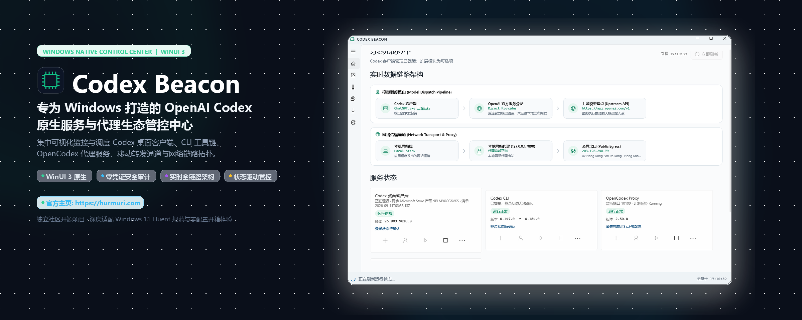

<p align="center">
  <a href="https://hurmuri.github.io/codex-beacon/"></a>
</p>

<h1 align="center">Codex Beacon</h1>

<p align="center">
  <strong>Codex 一站式管理中心：统一调度 ChatGPT 桌面端与 Codex CLI，支持可选 OpenCodex、Relay 与 Tailscale 扩展。</strong>
</p>

<p align="center">
  <a href="https://hurmuri.github.io/codex-beacon/"><strong>🌐 官方主页 GitHub Pages</strong></a> · 
  <a href="#下载与直接运行"><strong>⚡ 下载免安装便携版</strong></a> · 
  <a href="README.md">English Documentation</a>
</p>

<p align="center">
  <a href="https://hurmuri.github.io/codex-beacon/"></a>
  <a href="https://github.com/hurmuri/codex-beacon/releases"></a>
  <a href="https://github.com/hurmuri/codex-beacon"></a>
  <a href="https://learn.microsoft.com/windows/apps/winui/winui3/"></a>
  <a href="LICENSE"></a>
  <a href="https://github.com/openai/codex"></a>
  <a href="https://github.com/lidge-jun/opencodex"></a>
  <a href="https://github.com/gronxb/codex-relay"></a>
  <a href="https://tailscale.com"></a>
</p>

Codex Beacon 是一个明亮主题的 WinUI 3 本机控制台，用于检查和管理 Windows 上的 Codex 桌面客户端、Codex CLI、OpenCodex Proxy、Codex Relay、Node.js/NVM/npm 与 Tailscale。

支持英文和简体中文，默认跟随 Windows 显示语言，也可在设置页切换。`build/version.txt` 是唯一版本源，每次构建都会自增；当前运行版本始终显示在「设置 → 关于与更新」中。Codex 桌面客户端与 CLI 是产品核心；OpenCodex Proxy 和 Codex Relay 为独立可选模块。安装扩展不会自动修改 Codex 的当前 provider。

## 关于项目 (About)

Codex Beacon 是专为 Windows 平台打造的 OpenAI Codex 工具链开源桌面管理看板。随着本地 AI 辅助研发工具链的扩展，开发者通常需要协同管理多个独立服务：OpenAI 官方 Codex 桌面客户端（`OpenAI.Codex`）、Codex CLI、社区模型代理扩展 OpenCodex、移动端远程中继 Codex Relay、特定版本的 Node.js/NVM 运行时环境，以及 Tailscale 组网连接。

在此之前，排查服务状态需要频繁穿梭于任务管理器、多开的 PowerShell 窗口、npm 全局包命令与各 TOML 配置文件之间。Codex Beacon 将这一整套分散的生命周期管理统一收敛至原生桌面面板中。

### 核心特性

- **微软原生体验**：基于 WinUI 3 与 Windows App SDK 1.8 打造，遵循 Windows 11 Fluent 视觉与动效规范。轻量明亮主题，杜绝 Web/Electron 包装带来的冗余资源消耗。
- **受保护的凭据输入**：vNext Provider 编辑器使用默认隐藏的密码框。用户明确保存后，Key 以明文写入仅当前 Windows 用户可访问的本地配置文件，并排除在上传、命令行、日志、错误、诊断、崩溃报告、状态文字和默认导出之外。
- **状态驱动操作**：所有控制按钮（安装、登录、启动、停止、重启、升级）均由真实运行状态驱动，杜绝盲目点击导致的冲突或脏配置。
- **独立解耦架构**：Codex 官方客户端与 CLI 为产品核心，OpenCodex 与 Codex Relay 为独立可选扩展；缺少可选组件绝不会判定系统异常。
- **原生双语支持**：完整支持英文与简体中文，跟随系统或在设置中一键即时热切换，无需重启应用程序。
- **应用内自更新**：查询官方 GitHub 发行通道，发现新版本时在窗口顶部提示；下载过程实时显示进度与速度并做 SHA-256 校验，校验通过后原地替换安装包并自动重启到新版本。

## 上游项目与参考

- [Codex CLI · openai/codex](https://github.com/openai/codex)
- [OpenCodex · lidge-jun/opencodex](https://github.com/lidge-jun/opencodex)
- [Codex Relay · gronxb/codex-relay](https://github.com/gronxb/codex-relay)
- [NVM for Windows](https://github.com/coreybutler/nvm-windows)
- [Node.js](https://github.com/nodejs/node)、[npm CLI](https://github.com/npm/cli)
- [Tailscale](https://github.com/tailscale/tailscale)
- [Wangnov/Codex-App-Manager](https://github.com/Wangnov/Codex-App-Manager)：Codex 桌面版本管理参考。
- [v2fly/domain-list-community](https://github.com/v2fly/domain-list-community)：网络域名分类参考；当前版本未打包或读取其规则。

## 已实现

- Codex 桌面客户端与 CLI 分开检测版本、进程、账号和更新方式；每个可执行文件的版本按各自安装来源（npm 全局、`PATH` 或桌面端内置副本）单独读取，同一台机器可同时存在多个版本。
- 从 npm 官方注册表比较 `@openai/codex`、`@bitkyc08/opencodex` 与 `codex-relay` 的本机/最新版本。
- 按状态启用每个组件的安装、登录、启动、停止、重启与升级，并在安装页单独提供可选模块列表。
- NVM for Windows 检测、Node.js 版本列表、指定版本安装与当前版本切换。
- Node.js 下载使用可配置镜像，镜像不可用时自动回退官方源，`nodejs.org` 不可达也不会再卡住安装。
- 安装 npm 模块前验证 Node.js ≥ 22.14.0 与 npm 前置条件。
- 切换 Provider 时改写 `%USERPROFILE%\.codex\config.toml` 中的 `model_provider`，并按需写入或清除本地代理的 `openai_base_url`。
- 以 OpenAI 视角展示本机公网出口，并补充国家/地区、城市、运营商、AS 号、机房/住宅分类与信任分。
- Tailscale 服务、本机节点、Tailnet 设备、地址、在线状态和最后活动时间。
- 安全的批量停止/重启，排除 Codex 桌面应用、Codex Beacon 和无关 Node 进程。
- 长时间操作会流式输出原生工具进度并支持取消，且每个操作都有硬超时，界面不会看起来卡死。
- 英文与简体中文界面、诊断和操作结果，并支持应用内即时切换语言。
- 每次构建都会基于 `build/version.txt` 自增版本号，确保每个产物都有独立版本。
- 应用内自更新：对接官方 GitHub Releases 通道，包含版本检测、启动主动提示、手动检查、带进度与速度的流式下载、SHA-256 校验、跳过指定版本，以及原地重启到新版本。

## 已确认的 vNext 方向

完整产品规格以 [PRODUCT-REQUIREMENTS.md](PRODUCT-REQUIREMENTS.md) 为准。应用将采用九个聚焦页面：Codex 总览、依赖管理、Codex 进程、网络管理、Provider、OpenCodex、Tailscale、Codex Relay、设置/关于与更新。

总览只关注 ChatGPT 桌面端与当前用户实际使用的 Codex CLI；依赖修复、网络检测、Provider 增删改与测试，以及各可选模块均进入独立页面。OpenCodex 页面通过其结构化能力管理服务健康、Provider、静态/在线模型和 Codex 集成状态。

所有涉及下载的操作都必须显示真实阶段、已下载量/总量（可用时）、百分比、速度、耗时和安全取消。Provider Key 使用默认隐藏的密码框，并可明文保存到 `%USERPROFILE%\.CodexBeacon\providers.json`；`.CodexBeacon` 会显式设置 Windows 隐藏属性，该文件仅允许当前 Windows 用户访问，Key 不得上传或进入命令行、日志、错误、诊断和默认导出。

现有“关于与更新”完整保留。组件专属设置回到对应管理页：运行时源放在依赖管理，代理选项放在网络管理，OpenCodex 计划任务/服务设置放在 OpenCodex，Relay 计划任务/服务设置放在 Codex Relay。

## 下载与直接运行

GitHub Release 提供两个 x64 单文件可执行程序：

| 文件 | 适合场景 | 运行依赖 |
| --- | --- | --- |
| `CodexBeacon-portable.exe` | 推荐；单文件，双击即用 | 已内置 .NET 10 与 Windows App SDK |
| `CodexBeacon-slim.exe` | 已统一部署运行环境、希望减小下载体积 | [.NET 10 Desktop Runtime x64](https://dotnet.microsoft.com/download/dotnet/10.0) + [Windows App Runtime 1.8 x64](https://learn.microsoft.com/windows/apps/windows-app-sdk/downloads) |
| `SHA256SUMS.txt` | 两个单文件程序的 SHA-256 校验值 | — |

无需解压。首次运行时，启动器会把内嵌负载展开到 `%LOCALAPPDATA%\CodexBeacon\app-portable`，再从该目录启动管理器。应用内更新依赖这一结构：它下载与当前包类型匹配的单文件程序，原地替换该启动器并重新拉起，刷新后的启动器会重新展开负载。

Windows 不会默认附带 .NET 10 和指定版本的 Windows App Runtime；不确定时请选择 `portable`。

便携版本体只要求 Windows 10 1809（build 17763）或更高版本的 x64 Windows；状态采集使用系统自带的 Windows PowerShell 5.1。首次运行未签名的开源构建时，Windows SmartScreen 可能要求确认。联网仅用于获取最新版、打开官方安装程序、登录和查询公网出口。

Node.js、npm、NVM、Tailscale、OpenCodex 与 Codex Relay 都不是启动 Codex Beacon 的前置依赖。只有使用对应管理功能时才需要安装；界面会按“安装 → 登录 → 启动”的顺序引导。OpenCodex 和 Codex Relay 需要 Node.js 与 npm，其中 Relay 要求 Node.js ≥ 22.14.0。

自包含目录当前约 214 MB，压缩后约 87 MB。主要体积来自随包携带的 .NET 10、WinUI 3 / Windows App SDK、DirectML 与 ONNX Runtime。

## 构建与运行

从源码构建需要 Windows 10 1809 或更高版本，以及 .NET 10 SDK。

```powershell
dotnet build .\CodexBeacon.csproj -c Release
dotnet run --project .\CodexBeacon.csproj
```

生成独立运行目录：

```powershell
dotnet publish .\CodexBeacon.csproj -c Release -r win-x64 --self-contained true -p:WindowsAppSDKSelfContained=true -o .\publish\win-x64
```

## 权限与安全边界

### 默认非管理员模式（推荐）

Codex Beacon 设计为**默认无需管理员权限**即可开箱使用。核心功能在标准普通用户权限下均可完整运行：
- 实时探测 Codex 客户端、CLI、OpenCodex、Relay 运行状态与双层数据流动路径；
- 查询公网出口 IP、归属地、运营商及网络代理类型；
- 查看所有 Codex / ChatGPT 运行进程，一键终止进程与重新拉起 ChatGPT 客户端；
- 检测 NVM 与 Node.js 运行时环境。

### 需管理员权限的操作（界面带有 🛡️ 盾牌标识）

在 Windows 系统中，以下特定操作可能受 UAC 访问控制限制：
1. **Tailscale 系统服务控制**：通过 Windows 服务管理器启动、停止或重启 Tailscale 本地系统服务时，需要管理员权限；
2. **NVM 全局切换 Node.js（特定安装目录）**：若 NVM 将 Node 软链接安装在 `C:\Program Files\nodejs` 等系统保护目录，执行 `nvm use` 切换版本需管理员权限（若 NVM 安装在自定义数据盘或用户目录，则无需提权）；
3. **系统级计划任务注册**：若配置运行于系统服务账户下的计划任务，需要管理员权限。

### 权限区分与错误反馈

应用内部严禁任何静默提权行为。当非管理员身份执行上述受限操作时，系统会明确捕获权限不足提示，并在界面状态栏指引用户“以管理员身份运行 Codex Beacon”重试。

- 诊断不读取或显示 Token、授权头、密码、Cookie 和 API Key；已保存的 Provider Key 始终保持遮罩，并排除在诊断采集和导出之外。
- “远端服务 IP”是进程建立连接的目标，不等于本机公网出口 IP；界面会分开显示。
- Codex 桌面客户端当前版本来自本机 `OpenAI.Codex` MSIX/AppX 包。最新 Windows 包版本来自 Codex App Mirror 清单；该项目同步 Microsoft Store 产品 `9PLM9XGG6VKS`。界面明确标注来源，安装和升级始终打开官方 Microsoft Store 页面。

贡献规范见 [CONTRIBUTING.md](CONTRIBUTING.md)，设计约束见 [DESIGN.md](DESIGN.md)，安全说明见 [SECURITY.md](SECURITY.md)。项目采用 [MIT](LICENSE) 许可证。

## 本机适配

vNext 中，OpenCodex 页面负责配置 `opencodex-proxy` 计划任务/服务名称，Codex Relay 页面负责配置 `Codex Relay` 名称。默认检测以下端口，但当前数据流只采用与激活 provider 及运行证据相符的端点：

- OpenCodex Proxy：`127.0.0.1:10100`
- Codex Relay：`127.0.0.1:8787`
- 其他 provider：从 `%USERPROFILE%\.codex\config.toml` 动态解析
